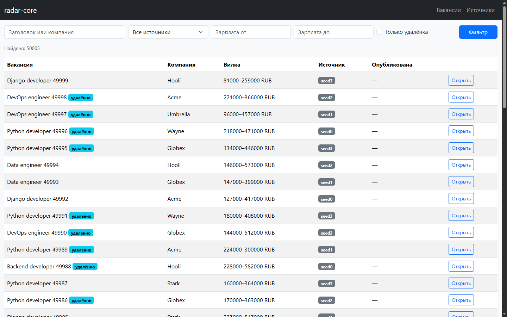
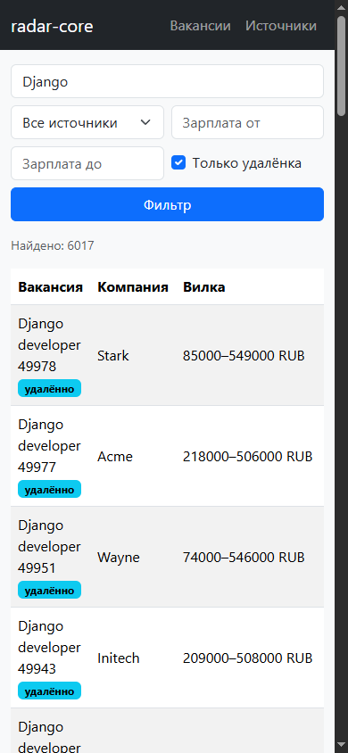
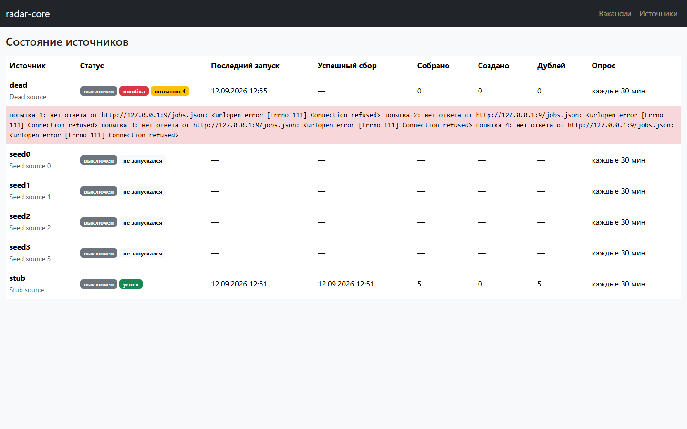
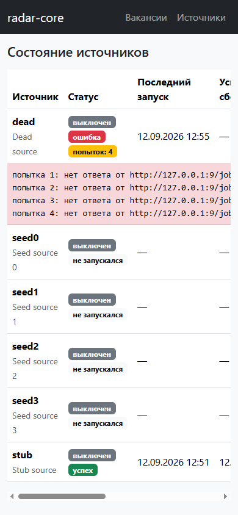

# radar-core

[](https://github.com/Regat1ve/radar-core/actions/workflows/ci.yml)

Сервис собирает вакансии из внешних источников по расписанию, приводит их к одному формату и показывает в интерфейсе: сбор идёт круглосуточно, повторный запуск не создаёт дублей, упавший источник виден сразу.

| десктоп | телефон |
|---|---|
|  |  |
|  |  |

## Запуск

```bash
cp .env.example .env && docker compose up --build
```

Поднимается пять сервисов: web, worker, beat, PostgreSQL 16, Redis. Миграции, статика и суперпользователь применяются на старте. Дальше: список вакансий на `http://localhost:8000/`, состояние источников на `/sources`, админка на `/admin` (логин и пароль из `.env`), API на `/api/vacancies`, `/api/vacancies/<id>`, `/api/sources`, проверка живости на `/health`.

## Инженерные решения

### Идемпотентность импорта

**Проблема.** Источник отдаёт одни и те же вакансии при каждом опросе, а опрос идёт каждые полчаса. Проверка «есть ли уже такая вакансия» перед вставкой не спасает: между проверкой и вставкой другой воркер успевает вставить свою строку, и в базе появляется дубль.

**Решение.** Уникальный индекс на паре «источник плюс внешний id» в самой базе, а не в коде:

```python
constraints = [
    models.UniqueConstraint(fields=["source", "external_id"], name="uniq_vacancy_source_external_id"),
]
```

Задача нормализации не проверяет наличие заранее, а пытается вставить и ловит `IntegrityError`: это и есть счётчик дублей. Гонка двух воркеров закрыта, потому что арбитром выступает база.

**Доказательство.** Два подряд идущих сбора одного набора из пяти позиций:

```
RUN1: success fetched: 5 created: 5 dups: 0
RUN2: success fetched: 5 created: 0 dups: 5
vacancies before: 5 after: 5
```

На настоящем PostgreSQL попытка обойти это руками даёт `duplicate key value violates unique constraint "uniq_vacancy_source_external_id"`.

### Ретраи и разделение отказов

**Проблема.** Внешний источник отваливается по-разному, и повторять нужно не всё. Таймаут, 429 и 500 пройдут со второй попытки, а 404 и 403 будут возвращаться вечно: повторять их означает зря жечь лимиты и забивать очередь.

**Решение.** Транспорт вынесен в отдельный модуль и переводит ответ сети в два класса ошибок: `RetryableError` для 429, 5xx, таймаута и обрыва связи, `FatalError` для остальных 4xx и битого JSON. Повторяется только первый класс:

```python
@shared_task(bind=True, acks_late=True, reject_on_worker_lost=True,
             autoretry_for=(RetryableError,), retry_backoff=2, retry_backoff_max=60,
             retry_jitter=True, max_retries=3)
```

Джиттер здесь не украшение: без него десяток источников, упавших от одного сетевого сбоя, вернётся в сеть одновременно и уронит её снова. Таймаут HTTP задан явно, запрос без таймаута висит до упора и держит воркер.

Отдельное решение в модели: `ImportRun` означает запуск сбора, а не попытку HTTP. Четыре попытки одного импорта остаются одной строкой с полем `attempts` и накопленной историей отказов. Иначе статистика источника врёт вчетверо.

**Доказательство.** Сбор с недоступного адреса, ретраи видны в логе воркера с растущей границей интервала:

```
Task fetch_source retry: Retry in 1s: RetryableError('нет ответа ... Connection refused')
Task fetch_source retry: Retry in 7s: RetryableError('нет ответа ... Connection refused')
```

В базе после всех попыток одна строка:

```
строк ImportRun: 1
id 9 | status failed | attempts 4
попытка 1: нет ответа от http://127.0.0.1:9/jobs.json: <urlopen error [Errno 111] Connection refused>
попытка 2: нет ответа от http://127.0.0.1:9/jobs.json: <urlopen error [Errno 111] Connection refused>
попытка 3: нет ответа от http://127.0.0.1:9/jobs.json: <urlopen error [Errno 111] Connection refused>
попытка 4: нет ответа от http://127.0.0.1:9/jobs.json: <urlopen error [Errno 111] Connection refused>
```

Ответ 4xx закрывает запуск сразу: одна строка, `attempts=1`, транспорт вызван один раз.

### Блокировка параллельного сбора

**Проблема.** Расписание может наложиться на ручной запуск, а медленный источник не успеть за свой интервал. Два одновременных сбора одного источника удваивают нагрузку на чужой сервер и наперегонки пишут в одни и те же строки.

**Решение.** Лок в Redis с TTL через `cache.add`, за которым стоит атомарный `SET NX EX`. Второй запуск не встаёт в очередь и не ждёт, а завершается сразу: к следующему тику расписания данные всё равно соберутся.

```python
if not cache.add(f"lock:fetch_source:{source_id}", "running", 600):
    return "locked"
```

TTL обязателен: без него воркер, убитый в момент сбора, оставил бы источник заблокированным навсегда.

**Доказательство.** При занятом локе задача возвращает `locked`, новый `ImportRun` не появляется:

```
second run result: locked
runs before: 2 after: 2
[WARNING/ForkPoolWorker-8] fetch_source: источник 2 уже собирается, пропускаю запуск
```

### N+1 и составной индекс

**Проблема.** Список вакансий показывает источник каждой строки. На наивной выборке это один запрос на список плюс по одному на каждую строку: на странице в сто вакансий получается сто один запрос вместо одного.

**Решение.** `select_related("source")` на списке и `prefetch_related` с ограниченной выборкой для последних запусков на странице источников. Фильтрация вынесена в одну функцию `collector.queries.filter_vacancies`, которую вызывают и API, и HTML-страница: так они не могут разъехаться, а чинить производительность нужно в одном месте.

**Доказательство.**

| выборка | SQL-запросов на 100 вакансий |
|---|---|
| `Vacancy.objects.all()` | 101 |
| `Vacancy.objects.select_related("source")` | 1 |

На живых ручках это два запроса на страницу в API и три на HTML-странице, независимо от числа строк.

Вторая часть: индексы. Замеры на 50 000 вакансиях по четырём источникам, база засевается командой `manage.py seed_vacancies --count 50000`. Существующие индексы `idx_vacancy_source_active` и `idx_vacancy_published_at` закрывают выборку активных вакансий источника и сортировку по дате публикации, но не закрывают другой частый запрос: удалёнка одного источника с сортировкой по верхней границе вилки.

```sql
SELECT id, title, salary_max FROM collector_vacancy
WHERE source_id = %s AND is_remote = true
ORDER BY salary_max DESC LIMIT 50;
```

`EXPLAIN ANALYZE` до индекса, база поднимает 7439 строк и досортировывает их в памяти:

```
Limit  (cost=1461.08..1461.21 rows=50 width=34) (actual time=2.246..2.250 rows=50 loops=1)
  ->  Sort  (cost=1452.92..1467.91 rows=5994 width=34) (actual time=2.246..2.247 rows=50 loops=1)
        Sort Key: collector_vacancy.salary_max DESC
        Sort Method: top-N heapsort  Memory: 30kB
        ->  Bitmap Heap Scan on collector_vacancy (actual time=0.270..1.618 rows=7439 loops=1)
              Recheck Cond: (source_id = $0)
              Filter: is_remote
              Rows Removed by Filter: 5061
              ->  Bitmap Index Scan on collector_vacancy_source_id_88b51dfb (actual time=0.193..0.193 rows=12500 loops=1)
Execution Time: 2.261 ms
```

После добавления миграцией составного индекса `(source, is_remote, -salary_max)` сортировка исчезает, читаются ровно нужные 50 строк:

```
Limit  (cost=8.45..42.47 rows=50 width=34) (actual time=0.009..0.025 rows=50 loops=1)
  ->  Index Scan using idx_vacancy_source_remote_sal on collector_vacancy (actual time=0.008..0.022 rows=50 loops=1)
        Index Cond: ((source_id = $0) AND (is_remote = true))
Execution Time: 0.034 ms
```

2.261 мс против 0.034 мс, в 66 раз быстрее, при этом порядок индекса повторяет порядок сортировки, иначе выигрыш был бы только на фильтре.

## Что проверяют тесты

38 тестов на pytest-django, прогон на каждом пуше и на каждом pull request: GitHub Actions поднимает PostgreSQL 16 и Redis, применяет миграции и запускает pytest. Живой сети в тестах нет, внешний источник подменяется. Проверяется не покрытие в процентах, а то, что дорого сломать.

**Нормализация полей.** Источники называют одно и то же разными словами: где-то `title`, где-то `name`. Если это сломать, импорт останется зелёным, а в базе неделю будут копиться вакансии без заголовков. Тесты держат границы: пустой ответ, вилка с одной границей, нераспознанная дата, строка длиннее столбца.

**Идемпотентность.** Главный тест проекта: второй прогон того же набора не создаёт дублей, счётчик дублей растёт, время последнего появления обновляется. Уберите уникальный индекс, и тест покраснеет раньше, чем база наберёт миллион копий одной вакансии.

**Отказ источника.** Отдельными тестами закреплено, что 429 и 5xx уходят в повтор, а 400, 401, 403 и 404 закрывают запуск без повторов. Сюда же таймаут, битый JSON и ответ без половины полей. Это те сценарии, которые руками не воспроизвести: чужой сервер не отдаёт 429 по заказу.

**Границы API и страниц.** Каждый фильтр возвращает ровно свой набор, фильтры складываются, пагинация не врёт в общем числе, деталь несуществующей вакансии отдаёт 404, на странице источников видно статус и число попыток.

**Регресс на производительность.** `django_assert_num_queries` на списке вакансий и в API, и на HTML-странице. Это единственный тест, который ловит не ошибку, а деградацию: если кто-то уберёт `select_related`, страница останется рабочей и внешне правильной, тест покраснеет сразу, а не через полгода после жалоб на медленный интерфейс.

## Чего здесь намеренно нет

**Микросервисов и Kubernetes.** Сбор вакансий это один процесс сбора, одна база и очередь. Резать его на сервисы означает добавить сетевые отказы между кусками, которые сейчас просто вызывают друг друга в одном процессе. Compose из пяти контейнеров поднимается одной командой и на ноутбуке, и на сервере.

**Flower.** Это ещё один сервис, порт и панель, которую надо закрывать авторизацией. Всё, что нужно для разбора инцидента, уже лежит в базе: `ImportRun` хранит статус, число попыток, счётчики и полный текст ошибок, и это видно на странице источников.

**Отдельного брокера результатов.** Результаты задач хранятся в том же Redis, что и очередь. Второе хранилище имело бы смысл, если бы результаты были нужны долго или переживали перезапуск, здесь они не нужны ни там, ни там.

**Своего JavaScript и SPA.** Для двух админских страниц с фильтрами React это лишний слой сборки и лишний источник ошибок. Формы обычные, GET, состояние фильтров живёт в адресной строке, страницы открываются по ссылке и работают без JS вообще.

**Bootstrap с CDN.** Файл лежит в репозитории и отдаётся самим приложением через whitenoise. Интерфейс не должен переставать работать оттого, что до чужого домена нет сети.

## Стек

Django 5, Celery с Redis в качестве брокера, PostgreSQL 16, Django REST Framework, Bootstrap 5 на шаблонах Django, pytest-django, Docker Compose, GitHub Actions.

## Структура

```
config/                 настройки, маршруты, Celery-приложение
collector/
  models.py             Source, ImportRun, RawItem, Vacancy и расписание сбора
  transport.py          поход в источник и классификация отказов
  tasks.py              fetch_source и normalize_run
  queries.py            общая фильтрация для API и страниц
  api.py                три эндпоинта на DRF
  views.py              две страницы и /health
  templates/, static/   шаблоны и Bootstrap
tests/                  нормализация, сбор, API, страницы
.github/workflows/ci.yml прогон тестов
```
